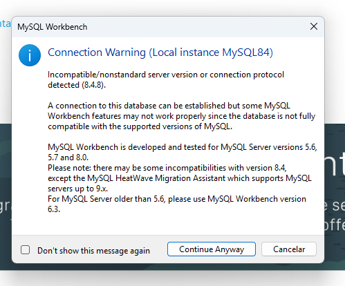
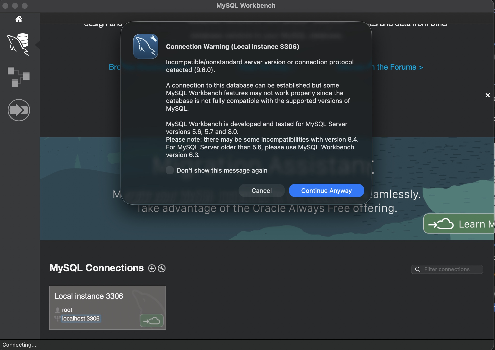

# Advertencias

> A algunos de nosotros nos ha aparecido una advertencia cuando intentamos conectarnos desde el Workench al servidor de base de datos.

> Esta advertencia nos informa que el número de versión del WorkBench es diferente al número de versión del servidor de base de datos

> Esto no es realmente un problema. Por eso podemos saltar esta advertencia y darle al botón que dice "Continue Anyway"
 
> Aquí dos capturas con la advertencia

